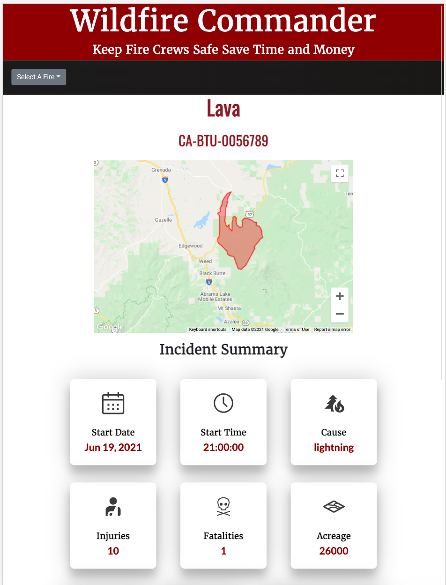

# Wildfire Commander 🌲🌲🌳🔥

## About
The Wildfire Commander app is a dashboard that renders data from a particular wildfire, a topo map of the fire perimeter and the current forecast for the area where the fire is occurring. If crucial data is all in one app, incident commanders will be better able to make quick, effective decisions and keep fire crews safe. 

## Inspiration
   There are many reasons why I wanted to build this app. In 1989, my  family was affected by the Lexington Fire. We experienced how fast a fire can move and how destructive fires can be. We didn't lose our home but our neighbors did, and it was devastating. My parents live in a high fire zone. Their property and home has been threatened by three serious fires. My brother works as a bulldozer operator for Cal Fire  and is often in harm's way on the fire line.  My finance also works on wildfires in the summer. 🚒   Fire is a natural process in our environment and it has been suppressed inappropriately for too long. The mega fires that we are experiencing in the Western United States are not natural.  We must learn how to manage our wildlands and wildfires effectively with better technology. 

## Technologies
 Wildfire Commander is built with the PERN(PostgreSQL, Express, React, Node) stack.

### APIS
  * [Google React Maps](https://tomchentw.github.io/react-google-maps/)
  * [Open Weather](https://openweathermap.org/appid) 

### [🔥 See Wildfire Commander in Action 🔥 ](https://stark-badlands-48876.herokuapp.com/) 

 

***
 

## 💻 Click [here](./docs/technicalInformation.md) for Technical Information on Running This App.

 

## MVP

Users should be able to...

* Choose a fire from the Choosefire dropdown menu
* View the incident name and number of the fire that the user selected
* The map should move to the fire selected. 
* Zoom in and out on the map and move the map
* View crucial data from the chosen fire 
* View weather in the vicinity of the fire

## Nice to Haves

* Since some data is sensitive, a customized login for the different tiers in the chain of command. 
* A backend with a login that allows the fire weather specialist team and the situational unit team to input data. 
* Additional links to render more data about the fire such as critical needs, fire weather report, incident objectives, a link to the IAP-Incident Action Plan, maps for the day, and resource tracking. 
* Integration with Esri's ArcGIS mapping software.
* A QR code for maps such as operations, communications, progression, planning, briefing, public information, evacuation, suppression repair, air operations, pilot, and transportation. 

## Acknowledgements 🙏 👏 
Thank you to the patient mentors who spent countless hours helping me throughout this project and to the managers at [Techtonica](https://techtonica.org/) who believed in me, guided me and supported me in my journey to becoming a software developer. 

* Andrew Peterson 
* Danielle Penny
* Richie Thomas
* George Song
* Sarah Cawley
* Cristina Rodriguez

## [Credits](./CONTRIBUTORS.md)

